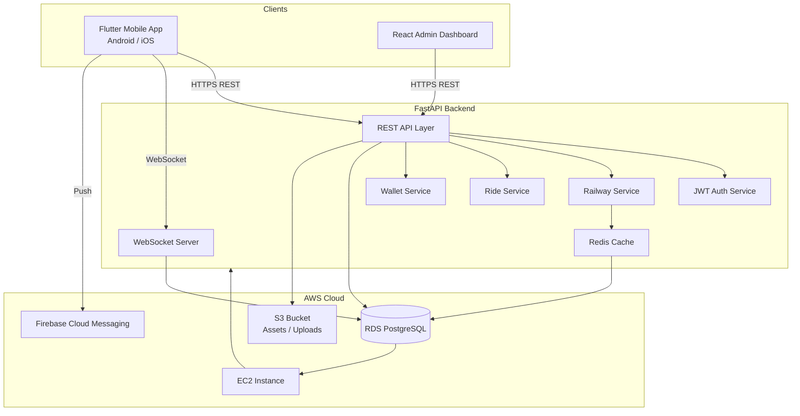
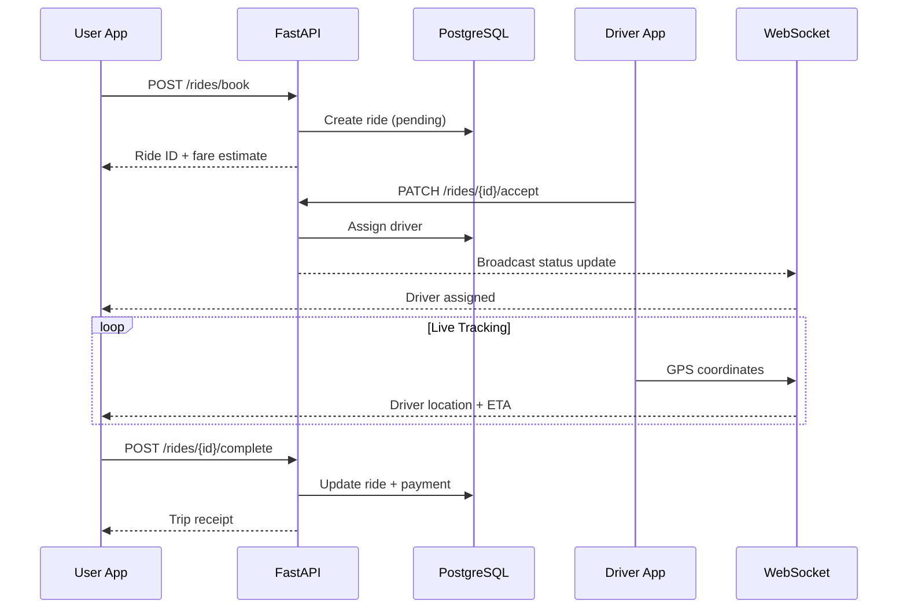

# RailRide Architecture

## System Overview

RailRide follows a **three-tier microservice-ready architecture** with a Flutter mobile client, FastAPI backend, and React admin dashboard sharing a common PostgreSQL database and Redis cache layer.



## Mobile App — Clean Architecture

```
mobile/lib/
├── core/           # Shared: theme, router, network, config
└── features/
    └── {feature}/
        ├── data/       # Repositories, API models, datasources
        ├── domain/     # Entities, use cases
        └── presentation/  # Screens, widgets, Riverpod providers
```

**State management:** Riverpod providers connect UI to repositories. JWT tokens are stored in `flutter_secure_storage` with automatic refresh via Dio interceptors.

## Backend Layers

```
backend/app/
├── api/v1/         # Route handlers (thin controllers)
├── services/       # Business logic
├── models/         # SQLAlchemy ORM models
├── schemas/        # Pydantic request/response schemas
├── core/           # Config, security, database, middleware
└── websockets/     # Real-time driver tracking
```

## Data Flow — Ride Booking



## Database Schema (Core Tables)

| Table | Purpose |
|-------|---------|
| `users` | Passenger & admin accounts |
| `drivers` | Driver profiles with GPS location |
| `vehicles` | Driver vehicle registration |
| `rides` | Ride bookings with pickup/drop coordinates |
| `payments` | Transaction records |
| `wallets` / `wallet_transactions` | User wallet balance & history |
| `notifications` | Per-user push notification log |
| `broadcast_notifications` | Admin-managed bulk notifications |
| `trains` / `stations` | Railway reference data |
| `favorite_trains` | User saved trains |
| `trip_history` | Unified trip log (train + ride) |
| `complaints` | Support tickets |
| `otps` | OTP verification codes |

## Security

- **JWT** access tokens (30 min) + refresh tokens (7 days)
- **bcrypt** password hashing
- **CORS** restricted to known origins in production
- **Admin routes** require `is_admin=True` on user record
- **WebSocket** connections authenticated via query token

## Scalability Considerations

- **Horizontal scaling:** Stateless API behind ALB; Redis for shared session/cache
- **Database:** RDS with read replicas for railway search queries
- **WebSockets:** Redis pub/sub for multi-instance WebSocket fan-out
- **CDN:** S3 + CloudFront for static assets and user uploads
- **Push:** Firebase handles millions of device tokens

## External Integrations

| Service | Usage |
|---------|-------|
| Google Maps API | Pickup/drop selection, route display, live tracking |
| Indian Railway API (mock) | Train search, PNR, live status |
| Firebase Cloud Messaging | Ride updates, train alerts, promotions |
| UPI Gateway | Wallet top-up and ride payments |
